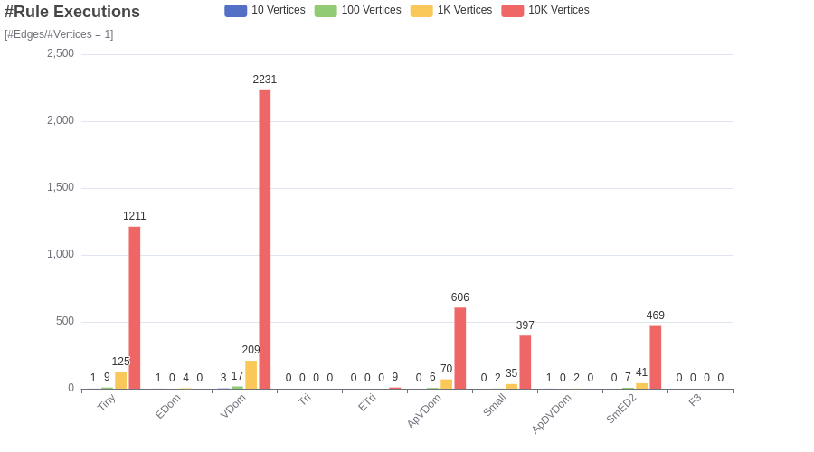
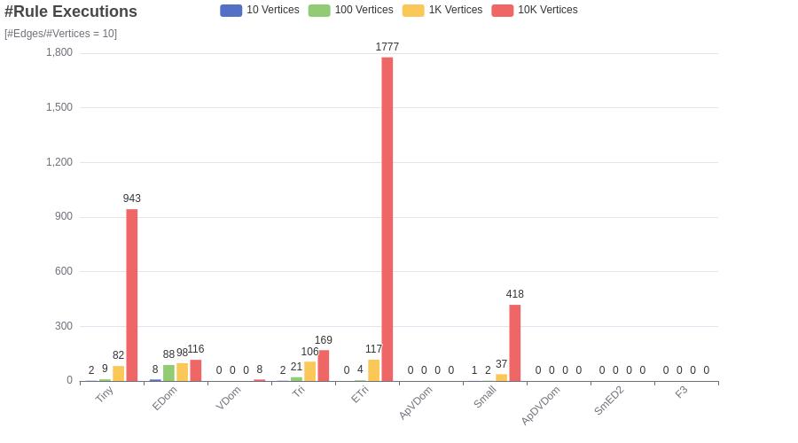
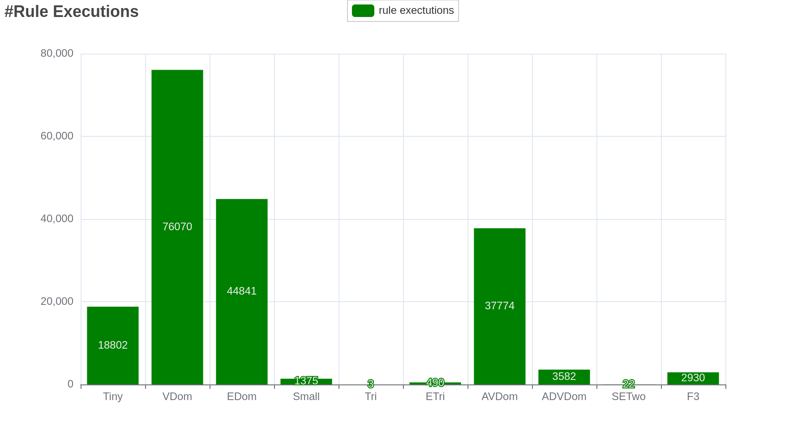
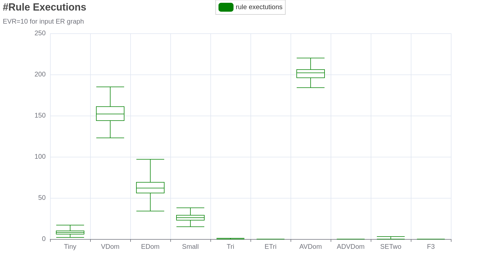
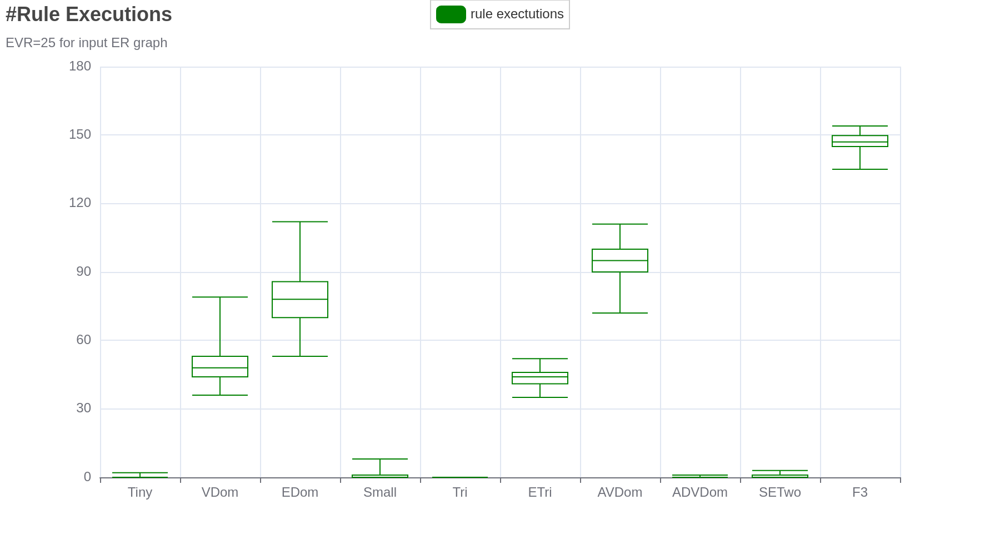
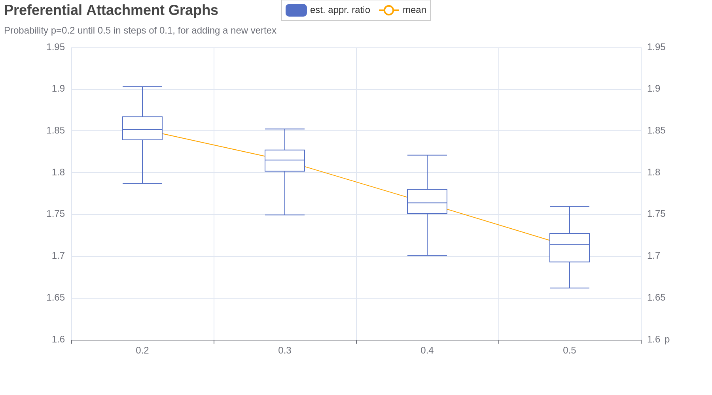
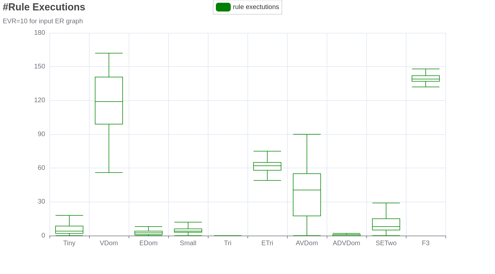
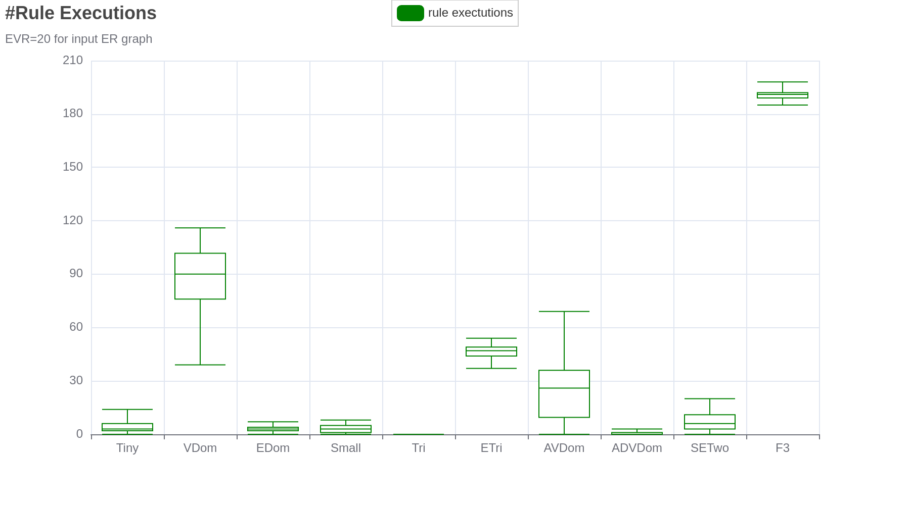

---
    title: Implementation and evaluation of a self-monitoring approximation algorithm for 3-Hitting-Set
    link-citations: true

...

\RestyleAlgo{ruled}
\DontPrintSemicolon
\SetAlgoVlined
\LinesNumbered
\listoftodos

# Programming Language

We chose the [Go](https://go.dev/) language. It is a statically typed, compiled language, with a C-like syntax. It is using a garbage collector to handle memory management, which at first seems off-putting for an application like this. Since Go's GC is very efficient, we are not worried about that fact. If the situation arises in which we do need to handle memory manually, we can utilize Go's $\texttt{unsafe}$ package in conjunction with C-interop.

# Datastructures

## Vertex

```go
type Vertex struct {
	id int32
	data any
}
```

The $\texttt{Vertex}$ datatype has two fields. The field $\texttt{id}$ is an arbitrary identifier and $\texttt{data}$ serves as a placeholder for actual data associated with the vertex.

## Edge

```go
type Edge struct {
	v map[int32]bool
}
```

The $\texttt{Edge}$ datatype has one field. The field $\texttt{v}$ is a map with keys of type $\texttt{int32}$ and values of type $\texttt{bool}$.

When working with the endpoints of an edge, we are usually not interested in the associated values, since we never mutate the edges.

This simulates a _Set_ datatype while allowing faster access times than simple arrays/slices.

## Hypergraph

```go
type HyperGraph struct {
	Vertices       map[int32]Vertex
	Edges          map[int32]Edge
	edgeCounter    int32
	IncMap         map[int32]map[int32]bool
	AdjCount       map[int32]map[int32]int32
}
```

\todo[backgroundcolor=green]{add new AdjCount field}

The $\texttt{HyperGraph}$ datatype has five fields. Both fields $\texttt{Vertices}$ and $\texttt{Edges}$ are maps with keys of type $\texttt{int32}$ and values of type $\texttt{Vertex}$ and $\texttt{Edge}$ respectively.

We chose this $\texttt{Set}$-like datastructure over lists again because of faster access times, but also operations that remove edges/vertices are built-in to the map type.

The field $\texttt{edgeCounter}$ is an internal counter used to assign ids to added edges.

The field $\texttt{IncMap}$ is a map of maps, essentially storing the hypergraph as a sparse incidence matrix. We will also derive vertex degrees from this map.

And at last the $\texttt{AdjCount}$ map, which will associate every vertex $v \in V$ all vertices adjacent to $v$. Additionally this map will also store the amount of times such a vertex is adjacent to $v$.
\todo[backgroundcolor=green]{add AdjCount explanation}

# Misc. Algorithms/Utilities

## Edge Hashing

```go
func getHash(arr []int32) string
```

Time Complexity: $n + n\cdot \log(n)$, where $n$ denotes the size of $\texttt{arr}$.

We start by sorting $\texttt{arr}$ with a $\textsc{Quick-Sort}$-Algorithm. We then join the elements of $\texttt{arr}$ with the delimiter $"|"$, returning a string of the form $"|id_0|id_1|\dots|id_n|"$.

Whenever we refer to $\textit{the hash of an edge}$ we refer to the output of this function, using the endpoints of the edge as the $\texttt{arr}$ argument.

## Compute Subsets of Size $s$

\todo{rewrite with new algorithm}

```go
func getSubsetsRecMain(arr *[]int32, i int, n int, s int, data *[]int32, index int, subsets *list.List)
```

Time Complexity: $2^n$

Let us explain all the arguments first.

-   $\texttt{arr}$ is a pointer to an array. This array is basically the input set whose subsets we want to compute.
-   $\texttt{i}$ is an index over $\texttt{arr}$
-   $\texttt{n}$ is the size of $\texttt{arr}$.
-   $\texttt{s}$ is the size of the computed subsets
-   $\texttt{data}$ is a temporary array
-   $\texttt{index}$ is an index over $\texttt{data}$
-   $\texttt{subsets}$ is a list that will store all the subsets of size $\texttt{s}$ we find

The implementation looks as follows.

```go
func getSubsetsRecMain(arr []int32, i int, n int, s int, data []int32, index int, subsets *list.List) {
	if index == s {
		subset := make([]int32, s)
		for j := 0; j < index; j++ {
			subset[j] = data[j]
		}
		subsets.PushBack(subset)
		return
	}

	if i >= n {
		return
	}

	data[index] = arr[i]

	getSubsetsRecMain(arr, i+1, n, s, data, index+1, subsets)
	getSubsetsRecMain(arr, i+1, n, s, data, index, subsets)
}
```

The algorithm is pretty simple. For every element $x$ in $\texttt{arr}$, we either put $x$ into $\texttt{data}$ or we do not. We have two base conditions.

1. If $\texttt{index} = \texttt{s}$, then we copy the contents of $\texttt{data}$ into an array and add it to $\texttt{subsets}$.
2. If $\texttt{i} \geq \texttt{n}$, then we have considered all elements for the current path of the search tree.

Lists in Go are not very memory efficient, but since we exclusively call this function with $\texttt{arr}$ representing the vertices in an edge, the value $\texttt{n}$ is usually fixed at 3. The raised memory problems occur at values of $\texttt{n}\geq 10000$, thus justifying the continued usage of lists.

For the case where we have to compute a lot of subsets, we provide a slightly different version of this function. Instead of passing in the $\texttt{subsets}$ list, we pass in a callback function that shall be called whenever we find a subset, using the found subset as an argument.

## Two-Sum

Given an array of integers and an integer target $t$, return indices of the two numbers such that they add up to $t$.

Time Complexity: $n$, where $n$ denotes the size of $\texttt{items}$.

$$
\begin{algorithm}
\nllabel{label}

\KwIn{An array of integers $arr$, a target value $t$}
\KwOut{Two indices $a,b$, such that $arr[a] + arr[b] = t$, a boolean indicating if a solution was found}
\BlankLine

$lookup \gets \texttt{map}[\mathbb{N}]\mathbb{N}$\;

\For{$i\gets 0$ \KwTo $len(arr)$}{
    \lIf{$lookup[t-arr[i]]$ exists}{
        \KwRet $(i, lookup[t-arr[i]]), true$\;
    }
    \Else{
        $lookup[arr[i]] \gets i$\;
    }
}
\KwRet $nil, false$\;

\caption{An algorithm for the \textssc{Two-Sum} problem}
\end{algorithm}
$$

We start by creating a map called $lookup$. Iterating other the elements of $arr$, we check if the entry $lookup[t-arr[i]]$ exists.

-   If the entry exists, we return a pair $(i, lookup[t-arr[i]])$ and the boolean value $true$ since we found a solution.
-   If the entry does not exist, we add a new entry to the $lookup$ map using $arr[i]$ as key and $i$ as value.

If no solution was found, we return $nil$ and the boolean value $false$.

This algorithm is an ingredient for the implementation of one of the reduction rules, specifically the Approximative Vertex Domination Rule. The actual implementation is accepting a map instead of an array as its first parameter.

# Hypergraph Models

## First Testing Model

```go
func GenerateTestGraph(n int32, m int32, tinyEdges bool) *HyperGraph
```

Let us explain the arguments first:

-   $\texttt{n}$ are the number of vertices the graph will have
-   $\texttt{m}$ is the amount of edges the graph will at most have
-   $\texttt{tinyEdges}$ when $\texttt{false}$ indicates that we do not want to generate edges of size 1.

We use a very naive approach for generating (pseudo-)random graphs.

We first create an empty Hypergraph struct and add $\texttt{n}$ many vertices to that graph.

We then compute a random $\texttt{float32}$ value $\texttt{r}$ in the half-open interval $[ 0.0, 1.0 )$. This value will be used to determine the size of an edge $e$. The edges are distributed based on their size as follows:

$$
size(\texttt{r})=
\begin{cases}
    1 & \quad \texttt{r} < 0.01\\
    2 & \quad 0.01 \leq \texttt{r} < 0.60\\
    3 & \quad \text{else}
\end{cases}
$$

We then store the result of $size(\texttt{r})$ in a variable $\texttt{d}$. We then randomly pick vertices in the half-open interval $[ 0, \texttt{n} )$, until we have picked $\texttt{d}$ many distinct vertices. We then check if an edge containing these vertices already exists. If it does not exist we add it to our graph.

That results in the graph having at most $\texttt{m}$ edges and not exactly $\texttt{m}$, since we did not want to artificially saturate the graph with edges.

Using an established model like the [Erdős–Rényi Model](https://www.semanticscholar.org/paper/On-random-graphs.-I.-Erdos-R%C3%A9nyi/e77e986f717b353329e2202c384c5499191a0646) would be more favourable. But since we just needed something tangible to start testing, this "model" will suffice for the time being.

One could also look into generating random bipartite graphs that translate back to a hypergraph with the desired vertex and edge numbers.

## Preferential Attachment Hypergraph Model

In the Preferential Attachment Model, one will add edges to an existing graph, with a probability proportional to the degree of the endpoints of that edge. This edge will either contain a newly added vertex, or will be comprised of vertices already part of the graph.

We will use an implementation by Antelmi et al. as reference [@SimpleHypergraphs.js], which is part of their work on _SimpleHypergraphs.jl_ [@DBLP:journals/im/SpagnuoloCSPSKA20], a hypergraph software library written in the Julia language. The implementation is based on a preferential attachment model proposed by Avin et al. in [@DBLP:journals/corr/AvinLP15].

```go
func GeneratePrefAttachmentGraph(n int, p float64, maxEdgesize int32)
```

-   $\texttt{n}$ is the amount of vertices the graph will have
-   $\texttt{p}$ is the probability of adding a new vertex to the graph
-   $\texttt{maxEdgesize}$ is the maximum size of a generated edge

## Preferential Attachment Hypergraph Model with high Modularity (Giroire et al.)

Looking at the first preferential attachment model, one can see that the resulting graph will be one big community.

We therefore also considered a model with high modularity proposed by Giroire et al.[@Giroire_Nisse_Trolliet_Sulkowska_2022].

# Reduction Rules

The ususal signature of a reduction rule looks as follows:

```go
func NameRule(g HyperGraph, c map[int32]bool) int32
```

We take both a \texttt{HyperGraph} struct \texttt{g} and a _Set_ \texttt{c} as arguments and mutate them. We then return the number of rule executions.

We prioritize time complexity over memory complexity when implementing rules, which does not equate to ignoring memory complexity completely.

## Executions

The proposed rules are meant to be applied exhaustively. A one to one implementation of a rule will only find one of the structures the rule is targeting. Calling such a rule implementation exhaustively will take polynomial time, but will be very inefficient in regards to memory writes and execution time. It is therefor necessary to design the algorithms for the rules with the aspect of exhaustive application in mind.

The general outline of an algorithm will look as follows,

1. Construct auxilliary data structures that are used to find parts of the graph, for which the rule can be applied.
2. As long as we can apply rules do:

    Iterate over the auxilliary data structure, or the vertices/edges themselves.

    - Identify targets of the rule.
    - Mutate the graph according to the rule.
    - Mutate the auxilliary data structure according to the rule.

This way we minimize memory writes by reusing existing data structures we built in step 1, but also save on execution time, since we mutate and iterate the auxilliary data structure at the same time.

## Algorithms

The algorithm descriptions occasionally omit implementation details. We do this to try and keep these descriptions as concise as possible. The real implementations correspond to the pseudocode listings.

We further introduce a $map$ data structure in our pseudocode with syntax $\texttt{map}[A]B$, which describes a mapping from $A$ into $B$. We use square brackets to indicate access and mutation of the mapping, e.g. $\gamma[0] \gets 1$. The map type also exposes a primitive function with the signature $delete(\gamma, x)$, which simply means that we want to delete the entry with key $x$ from our map. When iterating over a map in a \texttt{for}-loop we destructure the entries into a $(key, value)$-pair, e.g. $\texttt{for}\; (\_,v) \in map\; \texttt{do}$. Note that unused values are omitted with the underscore symbol.

### Tiny/Small Edge Rule

-   tiny edges: Delete all hyperedges of size one and place the corresponding vertices into the hitting set.
-   small edges: If $e$ is a hyperedge of size two, i.e., $e = \{ x,y \}$, then put both $x$
    and $y$ into the hitting set.

$O(|E|^2)$ **Algortihm**. We iterate over all edges of the graph. If the current edge $e$ is of size $t$, put $e$ into the partial hitting set and remove $e$ and all edges adjacent to vertices in $e$ from the graph.

$$
\begin{algorithm}
\nllabel{TinySmall}

\KwIn{A hypergraph $G=(V,E)$, a set $C$, an integer $t$ denoting the size of the edges to be removed}
\KwOut{An integer denoting the number of rule applications.}

\BlankLine
$rem \gets \emptyset$\;
$exec \gets 0$\;

\For{$e \in E$}{
    \If{$|e| = t$}{
        $exec \gets exec+1$\;
        \For{$v \in e$}{
            $C \gets C \cup \{v\}$\;
            $V \gets V\setminus \{v\}$\;
            \For{$f$ incident to $v$}{
                $E \gets E\setminus \{f\}$\;
            }
        }
    }
}

\KwRet $exec$\;

\caption{Algorithm for exhaustive application of Tiny/Small Edge Rule}
\end{algorithm}
$$

### Edge Domination Rule

-   (hyper)edge domination: A hyperedge $e$ is _dominated_ by another hyperedge $f$ if $f\subset e$. In that case, delete $e$.

$O(|E|)$ **Algorithm**. We partition our set of edges into two disjoint sets $sub$ and $dom$. The set $dom$ will contain edges that could possibly be dominated. The set $sub$ will contain hashes of edges $e$ that could dominate another edge.

We then iterate over the set $dom$ and compute every strict subset of the current edge $f$. For each of these subsets, we test if the hash of the subset is present in our set $sub$. If it is then $f$ is dominated by another edge.

$$
\begin{algorithm}
\nllabel{edom}
\SetKwFunction{subsets}{getSubsetsRec}
\KwIn{A hypergraph $G=(V,E)$ without size one edges, a set $C$}
\KwOut{An integer denoting the number of rule applications.}
\BlankLine

$sub \gets \emptyset$\;
$dom \gets \emptyset$\;
$exec \gets 0$\;

\For{$e \in E$}{
    \eIf{$|e| = 2$}{
        $sub \gets sub\cup \{ hash(e) \}$\;
    }{
        $dom \gets dom\cup \{ e \}$\;
    }
}

\If{$|sub| = 0$}{
    \KwRet $exec$\;
}
\BlankLine

\For{$e \in dom$}{
    $subsets \gets \subsets{e, 2}$\;
    \For{$f \in subsets$}{
        \If{$hash(f) \in sub$}{
            $E \gets E \setminus \{ e \}$\;
            $exec \gets exec+1$\;
            \textbf{break}\;
        }
    }
}

\KwRet $exec$\;

\caption{Algorithm for exhaustive application of Edge Domination Rule}
\end{algorithm}
$$

The exact time complexity is as follows:

$$
\begin{align*}
T &= |E| \cdot d\cdot \log (d) + (|E| \cdot (d + 2^d + (2^d \cdot d \cdot \log(d)))) \\
\end{align*}
$$

Specifically applied to $d=3$, this results in a time complexity of:

$$
\begin{align*}
T &= |E| \cdot 3\cdot \log (3) + (|E| \cdot (11 + 24 \cdot \log(3))) \\
&=|E| \cdot(3\cdot\log(3) + (11 + 24 \cdot \log(3)))
\end{align*}
$$

\begin{lemma}
Algorithm \ref{edom} finds all edges of G that are dominated, iff G has no size one edges.
\end{lemma}

_Proof._ Let $e$ be a dominated edge. Since there are no size one edges, edges with size two cannot be dominated. Thus $e$ has to be of size three. Then simply removing $e$ will not create or eliminate an edge domination situation. It is therefore sufficient to only check size three edges for the domination condition. $\square$

This also allows us to parallelize the main part of the algorithm, where we check each edge in our $dom$ set. We can achieve a speedup of $\approx 2$ on a six-core CPU an a pseudo-random graph with one million vertices and two million edges.

### Vertex Domination Rule

-   A vertex $x$ is dominated by a vertex $y$ if, whenever $x$
    belongs to some hyperedge $e$, then $y$ also belongs to $e$. Then, we can simply
    delete $x$ from the vertex set and from all edges it belongs to.

$O(|V| \cdot |E|)$ **Algorithm**
A vertex $v$ is dominated, if one of the entries in $\texttt{AdjCount}[v]$ is equal to $deg(v)$. In that case we remove $v$ from all edges and our vertex set.

$$
\begin{algorithm}
\nllabel{vdom}

\KwIn{A hypergraph $G=(V,E)$ }
\KwOut{An integer denoting the number of rule applications.}
\BlankLine

$exec \gets 0$\;

$outer \gets true$\;
\While{$outer$}{
    $outer \gets false$\;
    \For{$v \in V$}{
        $dom \gets false$\;
        \For{$(\_, val) \in AdjCount[v]$}{
            \If{$val = vDeg[v]$}{
                $dom = true$\;
                $\textbf{break}$\;
            }
        }
        \If{$dom$}{
            $outer = true$\;
            \For{$e$ incident to $v$}{
                $e \gets e\setminus \{ v \}$;
            }
            $V \gets V\setminus \{ v \}$\;
            $exec \gets exec+1$\;
        }
    }
}
\KwRet $exec$\;

\caption{Algorithm for exhaustive application of Vertex Domination Rule}
\end{algorithm}
$$

### Approximative Vertex Domination Rule

\todo[backgroundcolor=green]{remove explicit AdjCount generation, use the one provided by the graph struct}

-   approximative vertex domination: Assume there is a hyperedge $e = \{ x,y,z \}$ such that, whenever $x$ belongs to some hyperedge $h$, then $y$ or $z$ also belong to $h$. Then, we put $y$ and $z$ together into the hitting set that we produce.

$O(|V|\cdot |E|)$ **Algorithm**. The additional factor $|E|$ looks scary at first, but will only occur in the worst case, if there exists a vertex $v$, that is incident to all edges in $G$.

We start by iterating other the $AdjCount$ map of the graph, refering to the current value in the iteration as $AdjCount[v]$. We then use the $\textsc{Two-Sum}$-Algorithm to compute and return the first pair $(a,b)$ in $AdjCount[v]$, s.t. for $(a,b)$ holds,

$$
AdjCount[v][a] + AdjCount[v][b] = vDeg[v]+1
$$

If such a pair exists, then we conclude that for every edge $f$ such that $v \in f$, it holds that, either $a\in f$ or $b\in f$.

\begin{lemma} The outlined procedure above is correct, under the assumption that the underlying graph does not contain any duplicate edges.
\end{lemma}

_Proof._ Let $G$ be a hypergraph. We first remove all edges of size one with the _Tiny Edge Rule_. We then construct our map $AdjCount$. Let $v$ be an entry in $AdjCount$ and $sol=(a,b)$ the result of calling our $\textsc{Two-Sum}$ implementation on $AdjCount[v]$ with a target sum of $n=deg(v)+1$.

_Proposition._ If $sol$ is non-empty, then the edge $\{ v,a,b \}$ exists.

Let $sol=(a,b)$ be the solution obtained by calling our $\textsc{Two-Sum}$ algorithm on $AdjCount[v]$ with a target sum of $n=deg(v)+1$. For the sake of contradiction let us assume that the edge $\{ v,a,b \}$ does not exist. Since our graph does not contain duplicate edges and does not contain $\{ v,a,b \}$, there exist $deg(v)+1$ many edges that contain either $\{a,v\}$ or $\{b,v\}$. This however contradicts that there only exist $deg(v)$ many edges containing $v$. Therefore it must be, that the assumption that $\{ v,a,b \}$ does not exist, is false.

Since $\{ v,a,b \}$ exists, $a$ and $b$ can only occur $n-2 = deg(v) - 1$ times in other edges containing $v$. Since duplicate edges of $\{ v,a,b \}$ can not exist, we know that every other edge containing $v$ also contains $a$ or $b$, but not both simultaniously. $\square$

We then add the two vertices in the solution $sol$ to our partial solution $c$.

$$
\begin{algorithm}
\nllabel{apvdom}

\KwIn{A hypergraph $G=(V,E)$, a set $C$}
\KwOut{An integer denoting the number of rule applications.}
\BlankLine

$exec \gets 0$\;

$outer \gets true$\;
\While{$outer$}{
    $outer \gets false$\;
    \For{$(v, count) \in AdjCount$}{
        $sol, ex \gets \textsc{Two-Sum}(count, deg(v)+1)$\;
        \If{\textbf{not} $ex$}{
            \textbf{continue}\;
        }
        $outer \gets true$\;
        $exec \gets exec+1$\;

        \For{$w \in sol$}{
            $C\gets C\cup \{ w \}$\;
            $V \gets V\setminus \{ w \}$\;
            \For{$e$ incident to $w$}{
                $E \gets E\setminus \{ e \}$\;
            }
        }
    }
}

\KwRet $exec$\;

\caption{Algorithm for exhaustive application of Approximative Vertex Domination Rule}
\end{algorithm}
$$

**Idea**: The initial idea for this algorithm involved the usage of a complete incidence matrix, where edges are identified by the rows and the vertices are identified by the columns. To check the _Domination Condition_ for a vertex $v$, the algortihm would select all edges/columns that contain $v$ and then add up the columns. Now let $n$ be the amount of edges containing $v$. If there exist two entries in the resulting column that have a combined value of $n+1$, then the rule applies for $v$ under the assumption that there are no duplicate edges. This would result in an algorithm with a worse time complexity of $|V|+|V|^2\cdot|E|$.

### Approximative Double Vertex Domination Rule

-   approximative double vertex domination: Assume there is a hyperedge $e =
\{x, y, a\}$ and another vertex $b$ such that, whenever $x$ or $y$ belong to some
    hyperedge $h$, then $a$ or $b$ also belong to $h$. Then, we put $a$ and $b$ together
    into the hitting set that we produce.

$\mathcal{O}(|V|^2 + |E|)$ **Algorithm**. We start by creating a map called $tsHashes$, which maps subsets of $E$ to subsets if vertices. We then iterate over all vertices in $V$. For the current vertex $x$, compute all \textsc{Two-Sum} solutions with input array/map $AdjCount[x]$ and target $deg(x)$. If there exists a solution $sol = \{ z_0, z_1 \}$, such that $tsHashes[sol]\neq \emptyset$, then for all $y \in tsHashes[sol], y\neq x$ construct two edges $\{ x,y,z_0 \}$ and $\{ x,y,z_1 \}$. If one of these two edges exists in $E$, then we found a approximative double vertex domination situation. If $tsHashes[sol] = \emptyset$, map $tsHashes[sol]$ to $tsHashes[sol]\cup \{ x \}$.\todo[backgroundcolor=green]{change to new Two-Sum algorithm description}

\begin{lemma}
Algorithm \ref{apdvdom} is correct.
\end{lemma}

_Proof_.
Let $G=(V,E)$ be a hypergraph. Let $x$ be the current vertex in the algorithm's iteration over $V$. If $T = \textsc{Two-SumAll}(AdjCount[x], deg(x))$ is empty, then $x$ will not be able to trigger a approximative double vertex domination situation. If $T$ is not empty, then we know that there exist sets $\{ a,b \}$, such that all edges incident to $x$ either contain $a$ or $b$. If $tsHashes[\{ a,b \}]$ is empty, then there are currently no other vertices for which $\{ a,b \}$ is a \textsc{Two-Sum} solution. In that case we add $x$ to $tsHashes[\{ a,b \}]$. Otherwise there exist vertices $y$, such that $\{ a,b \}$ is a \textsc{Two-Sum} solution for $y$. All edges incident to $x$ and $y$ either contain $a$ or $b$. If for one of these vertices $y$ there exists a size three edge $\{ x,y,a \}$, or without loss of generality $\{ x,y,b \}$, then we found a approximative double vertex domination situation at $\{ x,y,a \}$ or $\{ x,y,b \}$ respectively. If none of these edges exist, then $x$ could still trigger another approximative double vertex situation with another vertex. Thus we need to add $x$ to $tsHashes[\{ a,b \}]$.
$\square$

$$
\begin{algorithm}
\nllabel{apdvdom}

\KwIn{A hypergraph $G=(V,E)$, a set $C$}
\KwOut{An integer denoting the number of rule applications.}
\BlankLine

$exec \gets 0$\;

$outer \gets true$\;
\For{$outer$}{
    $outer \gets false$\;
    $tsHashes \gets \texttt{map}[2^E]2^V$\;

    \For{$x \in V$}{
        \For{$sol \in \textnormal{\textsc{Two-SumAll}}(AdjCount[x], deg(x))$}{
            $\{ z_0, z_1 \} \gets sol$\;
            \eIf{$tsHashes[sol] \neq \emptyset$}{
                \For{$y \in tsHashes[sol]$}{
                    \If{$y = x$}{
                        \textbf{continue}\;
                    }
                    $f_0 \gets \{ x,y,z_0 \}$\;
                    $f_1 \gets \{ x,y,z_1 \}$\;

                    $found \gets false$\;
                    \For{$e \textnormal{ incident to }y$}{
                        \If{$e=f_0 \textbf{ or } e=f_1$}{
                            $found \gets true$\;
                            \textbf{break}\;
                        }
                    }

                    \If{found}{
                        $exec\gets exec + 1$\;
                        $outer\gets true$\;
                        $C\gets C \cup sol$\;
                        \For{$a \in sol$}{
                            \For{$e \textnormal{ incident to } a$}{
                                $E\gets E\setminus \{ e \}$\;
                            }
                        }
                        \textbf{break}\;
                    }
                    $tsHashes[sol] \gets tsHashes[sol] \cup \{ x \}$\;
                }
            }{
                $tsHashes[sol] \gets \{ x \}$\;
            }
        }
    }
}

\KwRet $exec$\;

\caption{Algorithm for exhaustive application of Approximative Double Vertex Domination Rule}
\end{algorithm}
$$

### Small Triangle Rule

-   small triangle situation: Assume there are three small hyperedges $e = \{y, z\}$, $f = \{x, y\}$, $g = \{x, z\}$. This describes a triangle situation $(e, f, g)$. Then, we put $\{x, y, z\}$ together into the hitting set, and we can even choose another hyperedge of size three to worsen the ratio.

$O(|E|+|V|^2)$ **Algorithm** We start by constructing an adjacency list $\texttt{adjList}$ for all edges of size two. We then iterate over the entries of the list. For the current entry $adjList[v]$ we compute all subsets of size two of the entry. If there exists a subset $s$ such that $s \in E$, then we found a small triangle situation. If we find a triangle situation we put the corresponding vertices in our partial solution and alter the adjacency list to reflect these changes. We do this by iterating over all vertices that are adjacent to the triangle. For every vertex $w$ of these vertices we delete all vertices of the triangle from the entry $adjList[w]$.

This last step will introduce the quadratic complexity, since in the worst case, for a vertex $v$ in a triangle, there could exist $|V|$ many size two edges that contain $v$. This worst case occurs very rarely, which justifies using this quadratic algorithm. We could alternatively move the last step of the algorithm outside of the loop, and wrap both procedures with an outer loop which breaks if we dont find any more triangles. This simulates calling the rule exhaustively, while achieving a linear time complexity.

$$
\begin{algorithm}
\nllabel{tri}
\SetKwFunction{subsets}{getSubsetsRec}
\KwIn{A hypergraph $G = (V, E)$, a set $C$}
\KwOut{An integer denoting the number of rule applications.}
\BlankLine

$adjList \gets \texttt{map}[V]2^V$\;
$rem \gets \emptyset$\;
$exec \gets 0$\;

\For{$e\in E$}{
    \If{$|e| \neq 2$}{
        \textbf{continue}\;
    }
    $\{ x,y \} \gets e$\;
    $adjList[x] \gets adjList[x] \cup \{ y \}$\;
    $adjList[y] \gets adjList[y] \cup \{ x \}$\;
}

\For{$(z, val) \in adjList$}{
    \If{$|val| < 2$}{
        \textbf{continue}\;
    }
    $subsets \gets \subsets{val, 2}$\;
    \For{$s\in subsets$}{
        $\{x,y\} \gets s$\;
        \If{$y \in adjList[x]$ \textnormal{\textbf{or}} $x\in adjList[y]$}{
            $exec \gets exec +1$\;
            $C\gets C \cup \{ x,y,z \}$\;
            $rem \gets rem \cup \{ x,y,z \}$\;
            \For{$u \in \{ x,y,z \}$}{
                \For{$v\in adjList[u]$}{
                    $adjList[v] \gets adjList[v]\setminus \{ u \}$\;
                }
                $delete(adjList, u)$
            }
            \textbf{break};
        }
    }
}

\For{$v \in rem$}{
    $V\gets V\setminus \{ v \}$\;
    \For{$e$ incident to $v$}{
        $E\gets E\setminus \{ e \}$\;
    }
}

\KwRet $exec$\;

\caption{: Algorithm for exhaustive application of Small Triangle Rule}
\end{algorithm}
$$

### Extended Triangle Rule

-   Assume that the hypergraph contains a small edge $e = \{y, z\}$. Moreover,
    there are hyperedges $f, g$ such that $e \cap f = \{ y \}$, $e \cap g = \{z\}$, $f \cup g=\{v, x, y, z\}$ and $|f| = 3$. Then, put all of $f \cup g$ into the hitting set.

### Small Edge Degree 2 Rule

-   small edge degree 2: Let v be a vertex of degree 2, and let the two hyperedges
    containing $v$ be $e = \{x, v\}$ and $f = \{v, y, z\}$. Then we can select a hyperedge $g$
    that contains one of the neighbors of $v$ in $f$ but not $x$, for example $g = \{u, w, z\}$
    (when $y = w$ is possible as a special case) or $g = \{u, z\}$. We put $x, u$ and $z$
    and $w$ (when existing) into the hitting set.

\todo[backgroundcolor=green]{add algorithm for SmallEdgeDeg2}

$$
\begin{algorithm}[H]
\nllabel{smallEdgeDegTwo}

\KwIn{A hypergraph $G=(V,E)$, a set $C$}
\KwOut{An integer denoting the number of rule applications.}
\BlankLine

$exec \gets 0$\;
$outer \gets true$\;

\For{outer}{
    \For{$v \in V$}{
        \If{$deg(v) \neq 2$}{
            \textbf{continue}\;
        }

        $s2,s3 \gets nil$\;
        \For{$e\textnormal{ incident to }v$}{
            \uIf{$|e| = 3$}{
                $s3 \gets e$\;
            }
            \uElse{$|e| = 2$}{
                $s2 \gets e$\;
            }
        }

        \If{$s2 = nil \textnormal{\textbf{ or }} s3 =nil$}{
            \textbf{continue}
        }

        $\{ x,\_ \} \gets s2$\;
        $found \gets false$\;
        $rem \gets nil$\;

        \For{$w\in s3\setminus \{ v \} $}{
            \For{$f \textnormal{ incident to } w$}{
                \eIf{$x \in f \textnormal{\textbf{ or }} s3 = f$}{
                    \textbf{continue}
                }{
                    $found \gets true$\;
                    $rem\gets f$\;
                    \textbf{break}\;
                }
            }
            \If{$found$}{
                \textbf{break}\;
            }
        }
        \If{$found$}{
            $outer \gets true$\;
            $exec \gets exec +1$\;
            \For{$a \in \{ x \}\cup f$}{
                $C\gets C\cup \{ a \}$\;
                \For{$h \textnormal{ incident to } a$}{
                    $E\gets E \setminus \{ h \}$\;
                }
            }
        }
    }
}

\caption{Algorithm for exhaustive application of Small Edge Degree 2 Rule}
\end{algorithm}
$$

## Self-Monitoring

Each of the reduction rule functions returns a $\texttt{int32}$ value, which indicates the number of rule executions.

We store the ratios for each rule in a map of the form:

```go
var ratios = map[string]pkg.IntTuple{
	"kRulename": {A:1, B:1},
}
```

Where $\texttt{A}$ denotes the amount of vertices put into the partial solution by a single rule execution. And $\texttt{B}$ denotes the amount of vertices present in an optimal solution.

We can then use these values to calculate the estimated approximation factor as follows:

```go
execs := ApplyRules(g, c)

var nom float64 = 0
var denom float64 = 0

for key, val := range execs {
	nom += float64(ratios[key].A * val)
	denom += float64(ratios[key].B * val)
}
```

We conducted some preliminary testing on graphs with 10, 100, 1000 and 10000 vertices. We calculateted the estimated approximation factor for these graphs. We did this for ratios $r = \frac{|E|}{|V|}$ of 1 to 20.

![Estimated Approximation Factor for Graphs with 10, 100, 1K, 10K Vertices for $r\in[1,20]$](img/line_fac.png)

We also looked at the number of rule executions for $r=1$ and $r=10$.





Note that the reduction rules alone are sufficient to compute a Hitting-Set for our graphs. The est. ratio is quite low, since we do not need to put whole size 3 edges into our hitting set. This is due to the way our random-graph model works. This will not work for all graph classes, namely 3-uniform graphs.

We can observe a large performance hit, once our graph is near 3-uniform. We present some ideas that could potentially speedup the execution for these graphs.

\todo[backgroundcolor=red]{remove Factor-3 Rule function paragraph}
**Factor-3 Rule Targeting**. The Factor-3 rule will select the to be removed edge at random. We could alternatively choose an edge $e$, s.t. the removal of $e$ will allow the execution of the Vertex Domination Rule. This could potentially lower the number of Factor-3 Rule executions quite significantly.

# Algorithms

## Main Algorithm

\todo{TODO}

## Incremental Frontier Algorithm

As experienced with the DBLP coauthor graph, there are some graph instances that do not work well with the prior algorithm. These instances do not admit a lot of rule executions after applying the fallback rule. Running the algorithm on the whole graph again, knowing that only small parts of the graph have changed is not very time efficient. The algorithm should only look at the part of the graph where the fallback rule was applied.

We therefore propose a new approach, which involves the usage of a _vertex frontier_. Such frontiers are common in search algorithms such as BFS, where each vertex in the frontier has the same distance to the root vertex. But let us explain the general structure of the algorithm first.

We first apply all reduction rules exhaustively for the entire graph $G$. If the graph has no more edges we are done. Else we try to find a size 3 edge $e$, which will trigger a vertex domination situation if removed. We then build up our initial frontier. We put all vertices into the frontier that are adjacent to a vertex in $e$, excluding vertices in $e$ itself. Then remove all edges that are incident to vertices in $e$. Next the frontier will be expanded, by adding all edges incident to the frontier to a new graph $H$. All vertices in $H$ that were not part of the frontier will form the next frontier. The amount of expansion steps can be set by the user. The fields \texttt{AdjCount} and \texttt{IncMap} of $G$ will be reused by $H$. Thus changes in $H$ will be reflected in $G$ and vice versa. The main loop will be explained next.

We apply the rules as usual, but only on $H$. The rules are modified, such that they also return the vertices adjacent to vertices in a modified/removed edge. If there are any, then $H$ will be expanded at these vertices and the loop will be continued. If not, apply the targeted fallback rule, considering the edges in the original graph $G$ and expand accordingly. This will be repeated until $G$ has no more edges.

\todo[backgroundcolor=green]{add new Frontier section}

$$
\begin{algorithm}[H]
\nllabel{3hs_frontier}

\KwIn{Hypergraph $G = (V, E)$, and a partial hitting set $C$}
\KwOut{A hitting set $C$}
\BlankLine

Apply all reduction rules exhaustively mutating $G$ and $C$\;
$l\gets 2$\;

\If{$|E| = 0$}{
    \KwRet $C$\;
}

$e\gets \texttt{F3TargetLowDegree}(G)$\;

$H \gets \texttt{GetFrontierGraph}(G, l, e)$\;
\tcc{$H$ will act as a mask over $G$, the rules will only be applied to vertices/edges in $H$}


\For{$|E| > 0$}{
    Apply all reduction rules exhaustively on $H$ mutating $H$,$G$ and $C$\;
    $exp\gets \textnormal{ vertices of edges adjacent to removed or modified edge }$\;
    \If{$|exp| > 0$}{
        $H\gets \texttt{ExpandFrontier}(G, l, exp)$\;
        \textbf{continue}\;
    }

    $e\gets \texttt{F3TargetLowDegree}(G)$\;
    \If{$e = \emptyset$}{
        \textbf{continue}\;
    }
    $H\gets \texttt{ExpandFrontier}(G, l, e)$\;
}

\KwRet $C$\;

\caption{Incremental 3-approximation algorithm for 3-HS}
\end{algorithm}
$$

# Applications and Results

## Triangle Vertex Deletion

[PROBLEM DEFINITION]

\textsc{Triangle Vertex Deletion} can be reduced to the \textsc{3-Hitting Set} problem. Triangles in the input graph will be represented as size 3 edges in a hypergraph, containing the vertices that make up the triangle.

### DBLP Coauthor Graph

We tested the algorithm on a DBLP coauthor graph and ER graphs of varying densities. It was considered to use the complete DBLP coauthor graph, which was quite large. We ultimately decided to use a dataset of the largest connected component. The network is made available by the [Stanford Network Analysis Project](https://snap.stanford.edu/data/com-DBLP.html) and part of a paper by J. Yang and J. Leskovec [@DBLP:journals/corr/abs-1205-6233] about community detection in real-world networks. The network contains 2224385 triangles, resulting in a \textsc{3-Hitting Set} instance of the same size. We now present the collected data during a run of the algorithm on this hypergraph.




The algorithm achieved a median estimated approximation ratio of $\approx 1.759$. Using the incremental algorithm, the previous execution time of around 25 minutes could be reduced to about 16 seconds.
\todo[backgroundcolor=green]{update the ratio and chart with frontier algorithm}

This speedup can be attributed to the fact, that the original coauthor graph exerts a community structure. These communities are preserved when converting it to a Triangle Vertex Deletion and thus 3-Hitting-Set instance. The expansion steps will therefore only expand the auxilliary graph $H$ inside these community. This drastically reduces the amount of edges the algorithm has to process per iteration. One can see the opposite happen in really dense hypergraphs without community structure. Due to the high density, even a small expansion two layers deep will add all edges of $G$ to $H$, eliminating possible gains. In fact, constant rebuilding of the auxilliary graph $H$ will even worsen the execution time.\todo{needs proof?}

Next we tested some variations of the algorithm. In our first test we disabled the use of the edge domination rule. This seems counter-intuitive at first, since the rule is reducing the problem instance "for free". But the fact that we use these data reduction rules in conjunction with approximative reduction rules makes the situation less predictable. What if we destroy favourable structures in our graph with the rule? And if so, how often does that happen? We ran the modified algorithm 100 times and collected data about the est. approximation ratio, hitting set sizes and the rule executions.\todo[backgroundcolor=green]{add new tables with dblp stats}

Table: (Results for \textsc{Triangle Vertex Deletion} on DBLP coauthor graph; n=100) \label{dblp_with_edom}

|        |       Ratio |       Tiny |         VD |         ED |     Small |    Tri |    ETri |        AVD |      ADVD |     SED2 |        F3 |   HittingSet |
|:-------|------------:|-----------:|-----------:|-----------:|----------:|-------:|--------:|-----------:|----------:|---------:|----------:|-------------:|
| median | 1.75946     | 18735.5    | 75990      | 44870      | 1372      | 3      | 546.5   | 37924.5    | 3621      | 26       | 2922      |  115650      |
| std    | 0.00050 |    30.30 |    68.20 |    60.33 |   24.43 | 0.66 |  15.54 |    55.32 |   37.52 |  4.24 |   19.86 |      85.16 |
| min    | 1.75778     | 18653      | 75829      | 44753      | 1318      | 1      | 510     | 37804      | 3534      | 16       | 2872      |  115403      |
| max    | 1.7606      | 18839      | 76195      | 45127      | 1430      | 4      | 588     | 38083      | 3703      | 38       | 2969      |  115836      |

Table: (Results for \textsc{Triangle Vertex Deletion} on DBLP coauthor graph; no edge domination rule; n=100) \label{dblp_noedom}

|        |       Ratio |       Tiny |         VD |   ED |    Small |   Tri |     ETri |        AVD |     ADVD |     SED2 |        F3 |   HittingSet |
|:-------|------------:|-----------:|-----------:|-----:|---------:|------:|---------:|-----------:|---------:|---------:|----------:|-------------:|
| median | 1.75709     | 18856.5    | 76258.5    |    0 | 790.5    |     0 | 434.5    | 38194.5    | 3718.5   | 15       | 2961.5    |  114948      |
| std    | 0.00054 |    36.35 |    78.04 |    0 |  17.00 |     0 |  14.92 |    59.54 |   37.31 |  3.31 |   19.57 |      78.17 |
| min    | 1.756       | 18744      | 76028      |    0 | 738      |     0 | 404      | 38071      | 3620     |  8       | 2910      |  114724      |
| max    | 1.75875     | 18915      | 76402      |    0 | 828      |     0 | 473      | 38327      | 3791     | 22       | 3014      |  115157      |

Next we looked at random ER graphs. We conducted the tests on graphs with $1000$ vertices and an edge to vertex ratio of 10 to 25. Data was collected for $100$ graphs per EVR.






## Cluster Vertex Deletion

## Preferential Attachment Hypergraphs




## 3-Uniform ER Hypergraphs





# Testing

Every reduction rule is tested for their correctness with unit tests. We create small graphs in these tests, that contain structures, which the rules are targeting. We then test for the elements in the partial solution, amount of edges/vertices left in the graph and degree of the vertices left.

# Branching Algorithm

## Potential Triangle Siutation

## Edge-Cover

If our problem instance is simple, we can solve it in polynomial time using an edge cover algorithm for standard graphs. We transform the hypergraph of our instance to a standard graph as follows:

-   Let $v$ be a hypergraph vertex with $\delta(v)=2$ and $e_0, e_1$ be the two edges that $v$ is incident to.
-   We then add two vertices to the auxilliary graph identified by $e_0$ and $e_1$. At last we add an edge $\{e_0, e_1\}$ identified by $v$.

## Possible Optimizations

Right now we sometimes use the Go $\texttt{apppend}$ function, to add elements to a slice. Calls to $\texttt{apppend}$ are more expensive than an ordinary assignment to a fixed size slice.

Using fixed size slices could improve performance slightly in cases where we know the maximum amount of elements we will add to a slice.

# References
